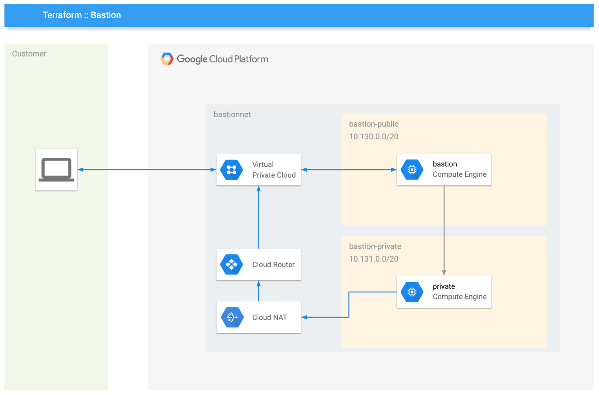

# What are you building

Your solution will look like this diagram:



# Steps to run

## Requirements

1.  Terraform installed on your machine
2.  Google Cloud SDK (`gcloud`) installed on your machine, authorized with your user
3.  a GCP project with an active Billing Account 
4.  enought IAM rights on the project for your user (in the worst case and demo only use Project Owner)

## 1. Preparation

Authorize `gcloud` to have a valid token useful for your terraform:

```bash
gcloud auth application-default login
# follow the steps via browser
```


## 2. Build it

Before starting, edit the file `staging.tfvars` with your preferred data, then prepare your workspace and apply as following. 

```bash
# use a dedicated workspace
terraform workspace new "staging"

# initialize all providers
terraform init

# see what will happen to your project, this will produce a state file called staging.out
terraform plan -var-file="staging.tfvars" -out=staging.out

# apply your plan leveraging the file staging.out
terraform apply "staging.out"

# see the status of your project
terraform show
```

## 3. Change something and apply it

Edit some stuffs on `.tf` files and then execute:

```bash
# if you changed something related to modules, re-initialize all providers
terraform init

# see what will happen to your project, this will produce a state file called staging.out
terraform plan -var-file="staging.tfvars" -out=staging.out

# apply your plan leveraging the file staging.out
terraform apply "staging.out"

# see the status of your project
terraform show
```

## 4. Clean up

```bash
# Warning: this will destroy everything you created before. You wont be able to undo it!
terraform destroy -var-file="staging.tfvars" -auto-approve
```