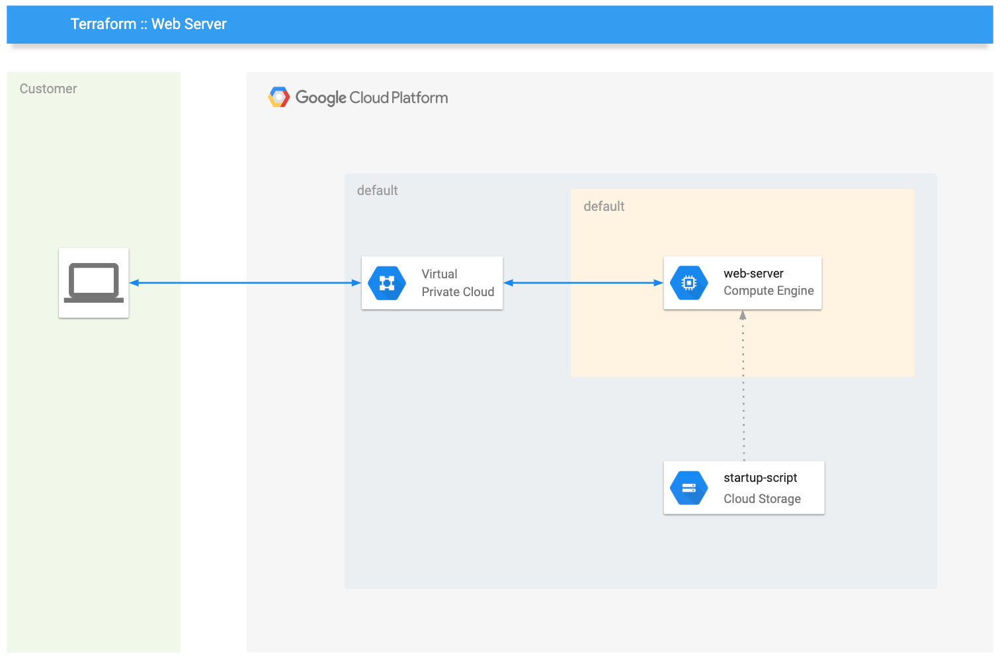

# What are you building

Your solution will look like this diagram:



# Steps to run

## Requirements

1.  Terraform installed on your machine
2.  a Service Account with `Project` > `Editor` IAM policy on your project

## Run it

Before starting, edit the file `demo.tfvars` with your data, then prepare your workspace and apply as following. 

```bash
# use a dedicated workspace
terraform workspace new "demo"

# initialize all providers
terraform init

# see what will happen to your project, this will produce a state file called demo.out
terraform plan -var-file="demo.tfvars" -out=demo.out

# apply your plan leveraging the file demo.out
terraform apply "demo.out"

# see the status of your project
terraform show
```

# Clean up

```bash
# Warning: this will destroy everything you created before. You wont be able to undo it!
terraform destroy -var-file="demo.tfvars" -auto-approve
```